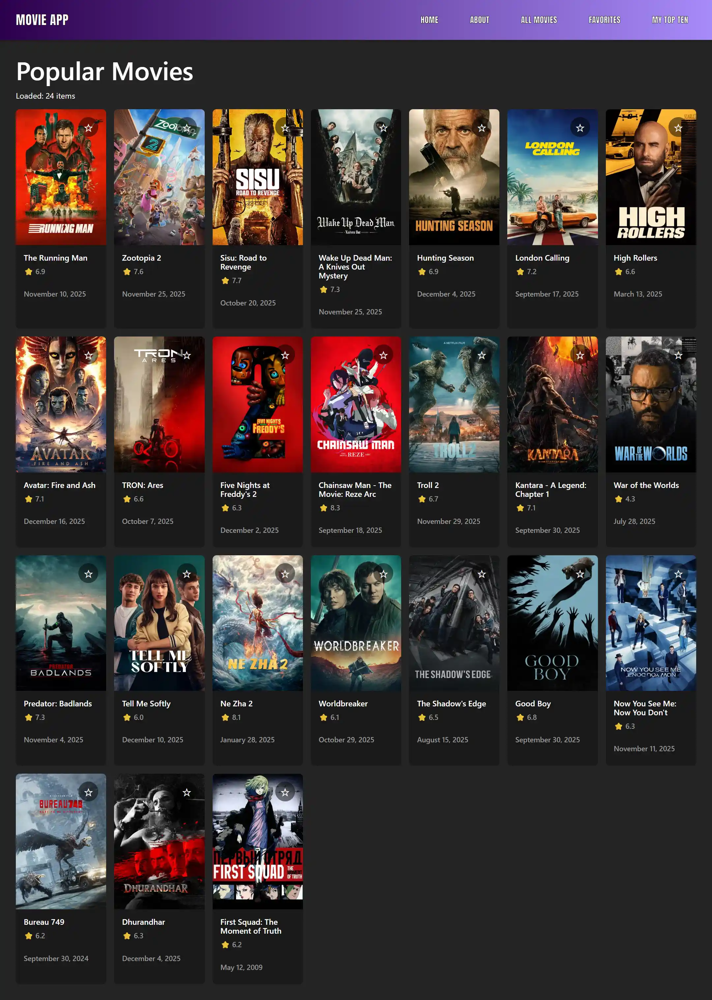
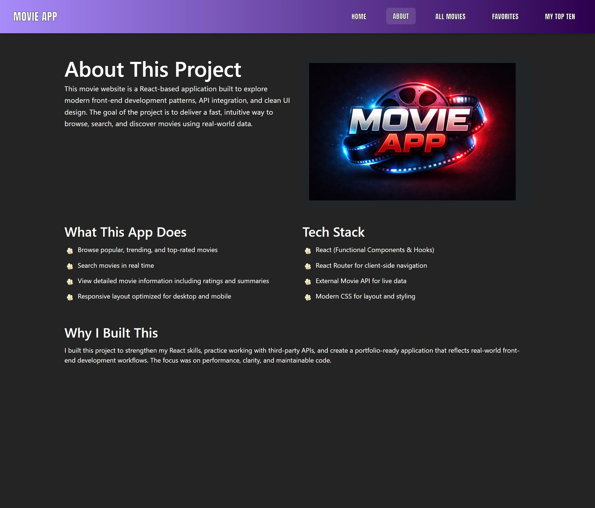

# 🎬 React Movie App

A fast, modern movie discovery app built with React and Vite.  
Browse trending movies, search titles, view details, and save favorites using real data from the TMDB API.

This project focuses on clean component structure, performance, and a polished user experience.

---

## 📸 Screenshots

<table align="center">
  <tr>
    <td valign="top">
      
    </td>
    <td valign="top">
      
    </td>
  </tr>
  <tr>
    <td valign="top">
      
    </td>
    <td valign="top">
      
    </td>
  </tr>
</table>

---

## ✨ Features

- Browse trending and popular movies
- Search movies by title
- View detailed movie information
- Save favorites locally
- Responsive layout for desktop and mobile
- Clean, modular React components
- Client-side routing with React Router

---

## 🛠 Tech Stack

- React
- Vite
- JavaScript (ES6+)
- CSS
- Bootstrap
- TMDB API

---

## 🔑 API Setup
This project uses the TMDB API.

Create a free account at https://www.themoviedb.org

Generate an API key

Add it to your environment variables

Example:

env
Copy code
VITE_TMDB_API_KEY=your_api_key_here
## 📌 Notes
Favorites are stored locally using browser storage

No backend required

Built as a portfolio-ready React project

---

## 📁 Project Structure
text
Copy code
react-movie-website/
├── frontend/
│   ├── public/
│   │   └── images/
│   └── src/
│       ├── components/
│       ├── pages/
│       ├── styles/
│       └── main.jsx
├── README.md 

---

## 🚀 Run Locally

```bash
cd frontend
npm install
npm run dev

