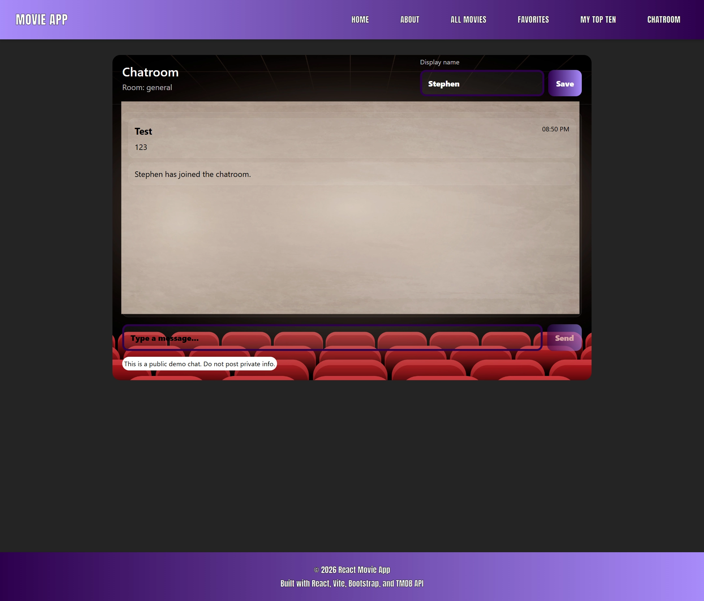

## React Movie Website

A responsive movie browsing application built with React and Vite using the TMDB API.  
This project demonstrates component-based architecture, API data fetching, loading states, and local persistence.

The active application lives in the `/frontend` directory.

---

## 📸 Screenshots

<table align="center">
  <tr>
    <td valign="top">
      
    </td>
    <td valign="top">
      
    </td>
  </tr>
  <tr>
    <td valign="top">
      
    <td valign="top">
      
    </td>
  </tr>
    <tr>
    <td valign="top">
      
    </td>
  </tr>
</table>

---

## ✨ Features

- Browse trending and popular movies
- Search movies by title
- View detailed movie information
- Save favorites locally
- Responsive layout for desktop and mobile
- Clean, modular React components
- Client-side routing with React Router
- Realtime authenticated chatroom
- Firebase Authentication (Email/Password)
- Firebase Firestore integration

---

## 🛠 Tech Stack

- React
- Vite
- JavaScript (ES6+)
- CSS
- Bootstrap
- TMDB API

---

## 📁 Project Structure
```text
react-movie-website/
├── frontend/
│   ├── public/
│   │   └── images/
│   └── src/
│       ├── components/
│       ├── pages/
│       ├── styles/
│       └── main.jsx
├── README.md

```  
---

## 🔑 API Setup
This project uses the TMDB API.

Create a free account at https://www.themoviedb.org

Generate an API key

Add it to your environment variables

Instructions:

add .env file to frontend folder
Copy code
VITE_TMDB_API_KEY=your_api_key_here
Replace your_api_key_here with key you got from https://www.themoviedb.org

## 📌 Notes
Favorites are stored locally using browser storage

No backend required

Built as a portfolio-ready React project

---

## 🚀 Getting Started

```bash
cd frontend
npm install
npm run dev
```

## 🔀 Environment Variables

Create a .env file in /frontend:

Create a .env file in the frontend directory.

Add all of the following variables:

### TMDB API
```env
VITE_TMDB_API_KEY=your_tmdb_api_key_here
```

### Firebase Configuration
```env
VITE_FIREBASE_API_KEY=your_firebase_api_key
VITE_FIREBASE_AUTH_DOMAIN=your_project_id.firebaseapp.com
VITE_FIREBASE_PROJECT_ID=your_project_id
VITE_FIREBASE_STORAGE_BUCKET=your_project_id.appspot.com
VITE_FIREBASE_MESSAGING_SENDER_ID=your_messaging_sender_id
VITE_FIREBASE_APP_ID=your_firebase_app_id
```

Where to get these values
TMDB

Create an account: <a href="https://www.themoviedb.org">https://www.themoviedb.org</a>

Generate an API key

Copy it into:

VITE_TMDB_API_KEY

## 💬 Realtime Chatroom

This project includes a fully functional realtime chatroom built with Firebase Firestore. Messages are sent and received instantly without requiring a custom backend server.

### Features

<ul>
<li>Realtime messaging using Firestore listeners</li>
<li>Persistent messages stored in the cloud</li>
<li>Display name stored locally per user</li>
<li>Automatic message ordering by timestamp</li>
<li>Responsive layout for desktop and mobile</li>
<li>State that chat requires signed-in users</li>
</ul>

## 🔐 Authentication & User Accounts

This application uses Firebase Authentication (Email and Password) to manage user accounts and secure access to the realtime chatroom.

Users can create an account or sign in using the following routes:

<ul>
<li>/signup Create a new account</li>

<li>/login Sign in to an existing account</li>

<li>/chat Access the realtime chatroom (authenticated users only)</li>
</ul>

When a user signs up or logs in for the first time:

<ul>
<li>A Firebase Authentication user is created</li>

<li>A corresponding user profile document is created in Firestore at users/{uid}</li>
</ul>

Each user profile document contains:

<ul>
<li>uid Unique user identifier from Firebase Auth</li>

<li>email User email address</li>

<li>displayName User chosen display name</li>

<li>createdAt Account creation timestamp</li>
</ul>

Authentication is required to:

<ul>
<li>Access the chatroom</li>

<li>Send and read chat messages</li>

<li>Prevent anonymous access and user impersonation</li>
</ul>

This setup demonstrates a complete authentication flow, secure database access, and real-world user management using Firebase.

### Tech Used

React

Firebase Firestore

Vite

CSS

### Route
/chat

### How it works

Messages are stored in Firestore under a rooms/general/messages collection

Firestore realtime listeners update the UI instantly when new messages are added

Collections and documents are created automatically on first message send

Firestore security rules allow read and create access for demo purposes


## 💾 Firebase Firestore Setup (Chatroom)
### 1. Log in to Firebase Console

Go to: https://console.firebase.google.com/

Sign in with your Google account.

###  2. Create (or select) your Firebase project

If you already made one, click it in the project list.

If not:

Click Add project

Name it (example: react-movie-website)

Google Analytics: optional (you can leave it off)

Click Create project

### 3. Add a Web App to the project

Inside your project, click the </> Web icon (Add app)

App nickname: react-movie-website (or similar)

Do not enable Firebase Hosting (not required)

Click Register app

You will see a Firebase config object (apiKey, authDomain, etc.)

You will use these values in your .env file (next step)

```env
VITE_TMDB_API_KEY=[place your key here]

VITE_FIREBASE_API_KEY=[place your key here]
VITE_FIREBASE_AUTH_DOMAIN=[place your key here]
VITE_FIREBASE_PROJECT_ID=[place your key here]
VITE_FIREBASE_STORAGE_BUCKET=[place your key here]
VITE_FIREBASE_MESSAGING_SENDER_ID=[place your key here]
VITE_FIREBASE_APP_ID=1:[place your key here]

```
Here is a tempate you can use wit hall variables needed for your .env file. Just .env don't put anything else as the file name.

### 4. Create the Firestore Database

Left sidebar: Build → Firestore Database

Click Create database

Choose Start in test mode for quick local development
(You will switch rules to production-safe rules after)

Pick a Firestore location (choose one close to you, any is fine)

Click Enable

### 5. Enable Authentication (required for secure chat rules)

Left sidebar: Build → Authentication

Click Get started

Go to Sign-in method

Enable Anonymous (fastest for demo)

Optionally also enable Email/Password later

6) Add Firestore Security Rules (recommended)

Left sidebar: Build → Firestore Database

Go to the Rules tab

Paste rules like this (collection name messages):

### Firestore Security Rules
Firestore security rules are used to protect user data and prevent unauthorized access.

The rules enforce the following:

<ul>
<li>Only authenticated users can read or write data</li>

Users can only read and update their own profile document at users/{uid}</li>

Users cannot access or modify other users’ profiles</li>

Only authenticated users can read and send chat messages</li>

Chat messages are validated for ownership and content length</li>

Messages cannot be edited or deleted after being created</li>
</ul>

These rules ensure:

<ul>
<li>No anonymous access to the database</li>

<li>No user impersonation</li>

<li>Data integrity for chat messages</li>

<li>A secure, production-ready Firestore setup</li>

</ul>

Security rules are managed in the Firebase Console under:
Build → Firestore Database → Rules

This approach mirrors real-world backend access control without requiring a custom server.

```env
rules_version = '2';
service cloud.firestore {
  match /databases/{database}/documents {

    // ----- Users profiles -----
    match /users/{uid} {
      // user can read/write only their own profile doc
      allow read: if request.auth != null && request.auth.uid == uid;

      allow create: if request.auth != null
        && request.auth.uid == uid
        && request.resource.data.uid == uid
        && request.resource.data.email is string
        && request.resource.data.displayName is string;

      // allow update but only on their own doc
      allow update: if request.auth != null && request.auth.uid == uid;

      // usually fine to disallow deletes
      allow delete: if false;
    }

    // ----- Chat messages -----
    match /messages/{messageId} {
      allow read: if request.auth != null;

      allow create: if request.auth != null
        && request.resource.data.text is string
        && request.resource.data.text.size() > 0
        && request.resource.data.text.size() <= 500
        && request.resource.data.userId == request.auth.uid
        && request.resource.data.createdAt is timestamp;

      allow update, delete: if false;
    }
  }
}

```

Click Publish

7) Add Firebase config to your local environment

In your React app root (where you run Vite), create or update .env:

```env
VITE_FIREBASE_API_KEY="..."
VITE_FIREBASE_AUTH_DOMAIN="..."
VITE_FIREBASE_PROJECT_ID="..."
VITE_FIREBASE_STORAGE_BUCKET="..."
VITE_FIREBASE_MESSAGING_SENDER_ID="..."
VITE_FIREBASE_APP_ID="..."
```

Important:

Restart your dev server after changing .env

8) Run the project and test the chatroom

Start the app:

<ul>
<li>npm install</li>

<li>npm run dev</li>

<li>Open the Chatroom page</li>

<li>Pick a display name and send a message</li>

Confirm it appears in Firestore:

Firebase Console → Firestore Database → Data → messages
</ul>


> **Note**
> The realtime chat feature requires a Firebase project with Firestore enabled.
> Reviewers can still run the app without Firebase, but the `/chat` route will not send or receive messages unless Firebase environment variables are configured.
>
> Firebase setup guide: https://firebase.google.com/docs/web/setup